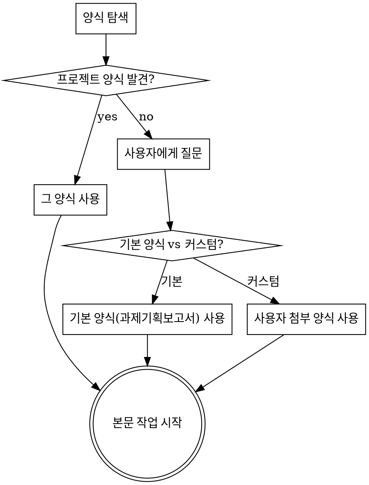

# hwpx 문서 작업 플로우

hwpx(한글) 기획서·제안서·보고서를 양식 기반으로 작성·검토·통합하는 워크플로우.
1인 작업과 PM + 파트별 팀원 협업 양쪽에 적용한다.
모든 hwpx 입출력은 **hwpxskill**(XML-first, 양식 스타일 보존)을 사용한다.

## 0. 시작 절차 — 양식 확정 (작업 전 가장 먼저, 필수)

본문을 한 글자도 쓰기 전에 **사용할 양식을 먼저 확정**한다. 양식 없이 본문 작업을 시작하지 않는다.



### 1단계: 프로젝트 양식 탐색

다음 순서로 프로젝트가 지정한 양식이 있는지 찾는다:

1. 프로젝트 루트 `CLAUDE.md`(및 `AGENTS.md`/`GEMINI.md`)에 양식 경로·양식 규칙이 명시되어 있는지
2. 프로젝트 내 `양식/`, `templates/`, `서식/` 등의 폴더에 `*.hwpx` 양식 파일이 있는지
3. 프로젝트에 이미 진행 중인 동종 문서(통합본·이전 산출물)가 있어 그 스타일을 양식으로 삼아야 하는지

→ **발견하면** 그 양식을 사용한다. (어떤 양식을 쓸지 한 줄로 사용자에게 알리고 진행)

### 2단계: 양식을 못 찾았을 때 — 질문 후 진행 (멋대로 진행 금지)

프로젝트 지정 양식이 없으면 **추측하지 말고 사용자에게 다음을 질문**한다:

- **(A) 기본 양식 사용** — 이 스킬에 내장된 `templates/과제기획보고서 양식.hwpx`
  (**과제기획보고서 작성의 기본 양식**. 내장 기본 양식은 이 한 종뿐임)
- **(B) 커스텀 양식 첨부** — 사용자가 사용할 `.hwpx` 양식을 첨부

> 요청 문서가 과제기획보고서가 아닌 다른 종류(제안서·결과보고서 등)이고 프로젝트 양식도 없으면,
> 기본 양식(A)은 구조가 맞지 않을 수 있음을 알리고 (B) 커스텀 양식 첨부를 권한다.

사용자 선택 전에는 본문 작업을 시작하지 않는다. 선택 후 해당 양식의 목차 구조·스타일을 기준으로 작업한다.

> 기본 양식 경로(이 스킬 기준 상대경로): `templates/과제기획보고서 양식.hwpx`
> **양식 원본은 절대 수정하지 않는다.** 복사본을 만들어 작업한다.

## 디렉토리 규약 (팀 협업 시)

프로젝트 루트 기준 권장 구조 (단일 작업이면 산출물 파일만 생성):

```
{문서폴더}/
├── 작성중/{파트명}/{작업명}.hwpx     # 팀원 작업 공간 (작업 중 파일)
├── 통합요청/{파트명}-{작업명}.hwpx   # 작성 완료본 (PM 인입 큐)
├── 통합완료/{파트명}-{작업명}.hwpx   # PM이 통합 처리한 요청 파일 보관소
└── {문서명}_통합본_v{버전}.hwpx       # PM 산출물 (v1, v2, ... 순차 증가)
참고자료/
└── {파트명}/                          # 팀원별 출처·참고문헌 원본 보관소
    ├── {참고문헌 파일들}              # PDF 다운로드, 웹페이지 저장본, 통계 자료 등
    └── 출처목록.md                    # 파일명 ↔ 인용 위치 ↔ 서지정보 매핑
```

- {파트명}: 배정 단위 (예: 목차 단위 `1.2동향`, 주제 단위 `심사표준`·`플랫폼` — PM 배정 시 확정)
- {작업명}: 해당 파트 내 작업 단위 (예: `과제정의`, `정책동향`, `예산`)

### hwpx 작성 시 필수 주의 (실제 발생한 버그)

- **`<hp:linesegarray>` 요소는 반드시 삭제**: 양식 문단을 복사해 텍스트를 교체하면 원본
  텍스트 기준 줄배치 캐시(linesegarray)가 남아 **글자가 겹쳐 보이는 렌더링 깨짐** 발생.
  새로 작성·수정하는 모든 문단에서 linesegarray를 제거할 것 (선택적 캐시라 제거하면
  한글이 열 때 재계산함). PM도 통합 시 전체 제거를 기본 처리로 수행.

## 팀원 (파트 작성자) 절차

1. **배정 확인**: PM에게 배정받은 {파트명}/{작업명}과 담당 목차 범위 확인
2. **컨텍스트 로드**: 프로젝트 `CLAUDE.md`와 목차 매핑 문서가 있으면 담당 목차의 보유 자산·갭·작성 방침 확인
3. **작업 파일 생성**: `{문서폴더}/작성중/{파트명}/{작업명}.hwpx` 생성 후 작업
   - 양식: 0번에서 확정한 양식의 해당 목차 구조·스타일을 따른다 (hwpxskill 레퍼런스 복원 모드)
   - 양식 원본은 절대 수정하지 않는다
4. **작성 규칙 준수** (위반 시 PM이 반려):
   - 개조식 (서술형 종결어미 금지: "~합니다" ❌ / "~필요", "~해야 함" ⭕)
   - 표로 표현 가능한 내용은 표 우선, 중요 문장은 볼드·밑줄 강조
   - 번호체계: `I, 1, 1.1, 가, □, ○, -` (양식 스타일 사용)
   - 익명성·기밀 요건이 있으면 기관명·식별 가능 고유명사 노출 금지 (프로젝트 CLAUDE.md 규칙 우선)
   - 용어 일관성, 표·그림 출처 표기, 인용 각주
5. **출처 자료 보관 (필수)**: 작성 중 활용한 **웹서칭 결과, 보고서, 기사, 통계 등 모든 출처
   자료를 `참고자료/{파트명}/`에 원본 파일로 저장** (PDF 다운로드, 웹페이지 저장 등)
   - `참고자료/{파트명}/출처목록.md`에 매핑 기록: 파일명 ↔ 본문 인용 위치(목차 번호·각주 번호)
     ↔ 서지정보(저자, 제목, 발행처, 일자, URL)
   - 본문에 출처 없는 수치·인용 금지 — 각주·표 출처와 보관 파일이 1:1 추적 가능해야 함
6. **통합 요청**: 작업 완료 시 `{문서폴더}/통합요청/{파트명}-{작업명}.hwpx`로 복사
   - 작성중 폴더의 원본은 삭제하지 않고 유지 (수정 이력용)

## PM (통합 팀장) 절차

### 1. 작업 배정

- 목차 매핑 문서가 있으면 목차별 상태와 우선순위를 기준으로 파트를 나눠 배정
- 배정 시 명시할 것: {파트명}, {작업명}, 담당 목차 범위, 참조할 보유 자산, 마감
- 의존성 없는 뼈대 먼저, 리서치 필요 구간 병행, 숫자·예산 작업 후순위

### 2. 통합 처리 (통합요청 폴더 감시)

`{문서폴더}/통합요청/`에 파일이 올라오면:

1. **검토** — 통합 전 각 파일에 대해:
   - **용어 일관성**: 프로젝트 용어 규칙 기준으로 검토·일관화
   - **스타일링 일관성**: 양식 스타일 ID·번호체계·개조식·표 형식·강조 방식 검토·일관화
   - **익명성/기밀**: 노출 금지 고유명사 검사 (발견 시 익명화 처리)
   - **출처 추적성**: 본문의 각주·표 출처가 `참고자료/{파트명}/`에 원본 파일로 실재하고
     `출처목록.md`에 기록되어 있는지 검증 (누락 시 반려)
2. **통합** — 기존 최신 통합본(없으면 양식)을 베이스로 해당 파트를 목차 순서에 맞게 병합하여
   `{문서폴더}/{문서명}_통합본_v{버전}.hwpx` 생성 (버전 = 기존 최신 +1, 기존 통합본은 덮어쓰지 않음)
   - hwpxskill의 unpack → XML 병합 → pack 워크플로우 사용, `validate.py` 통과 필수
   - 병합 후 PM 표준 후처리: 전체 `linesegarray` 제거 → 추가 작업 필요 구절(※ 잠정 등) 빨간색 표시
3. **구버전 정리** — 새 통합본 생성 시 직전 버전을 `{문서폴더}/old/`로 이동.
   **`{문서폴더}/`에는 최신 통합본 1개만 유지** (구버전은 전부 old/에 보관)
4. **이동** — 처리 완료된 요청 파일을 `{문서폴더}/통합완료/`로 이동
5. **보고** — 통합 결과 요약: 반영된 파트, 일관화 수정 내역, 발견된 충돌·반려 사항

### 3. 반려 기준

다음의 경우 통합하지 않고 해당 팀원에게 수정 요청:
- 노출 금지 기관명/식별 고유명사 노출 (기밀 프로젝트 시 최우선 반려 사유)
- 출처 없는 수치·인용, 또는 참고자료 폴더에 원본 파일 미보관
- 서술형 문체, 양식 번호체계 미준수
- 프로젝트 CLAUDE.md 핵심 합의사항 위반

## 공통 규칙

- 분량은 양식·프로젝트 가이드라인 페이지 한도를 준수 (예: 통합본 40페이지 이내)
- 파일 덮어쓰기 금지 — 항상 새 버전 생성 (특히 Google Drive 공유 환경, git 없는 경우)
- 충돌(같은 목차를 두 파트가 작성 등) 발견 시 PM이 조정하고 CLAUDE.md에 결정 기록
